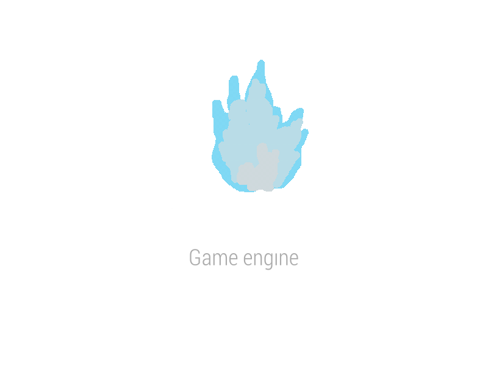

# Redot Engine

  

## 2D and 3D cross-platform game engine

**[FRACTOT]() is a feature-packed, cross-platform
game engine to create 2D and 3D games from a unified interface.** It provides a
comprehensive set of common tools, so that
users can focus on making games without having to reinvent the wheel. Games can
be exported with one click to a number of platforms, including the major desktop
platforms (Linux, macOS, Windows), mobile platforms (Android, iOS), as well as
Web-based platforms and consoles.

## Free, open source and community-driven

Redot is a completely free and open source fork of Godot under the very permissive MIT license.
No strings attached, no royalties, nothing. The users' games are theirs, down
to the last line of engine code. Redot's development is fully independent and truly
community-driven, empowering users to help shape their engine to match their
expectations.

Before being open sourced in [February 2014](https://github.com/godotengine/godot/commit/0b806ee0fc9097fa7bda7ac0109191c9c5e0a1ac),
Godot had been developed by [Juan Linietsky](https://github.com/reduz) and
[Ariel Manzur](https://github.com/punto-) (both still maintaining Godot)
for several years as an in-house engine, used to publish several work-for-hire
titles.

FRACTOT was forked from Godot

## Getting the engine

### Binary downloads

### Compiling from source

[For the time being, see the official Godot docs](https://docs.godotengine.org/en/latest/contributing/development/compiling)
for compilation instructions for every supported platform.

## Community and contributing

